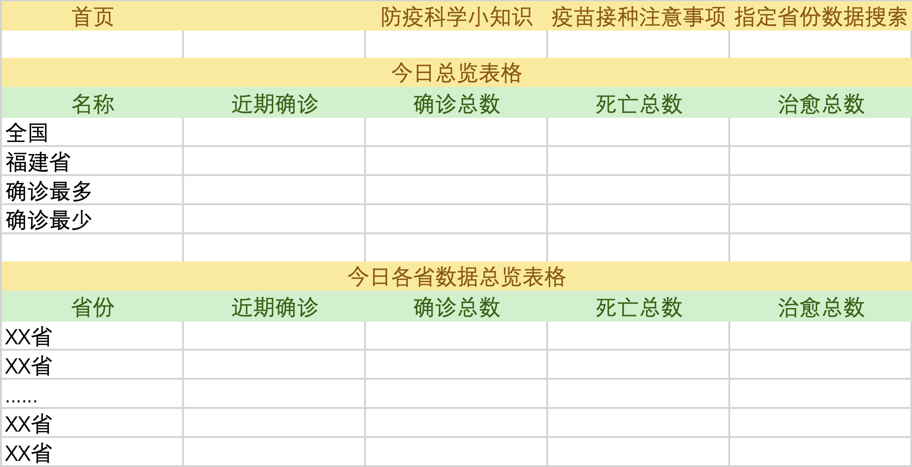

#### 项目设计
系统为用户提供一个 COVID19 疫情数据和分析结果的平台，系统采用 Python 语言作为数据抓取以及数据处理工具、采用 Java 作为 Web 服务端开发技术，采用网页和微信小程序作为客户端展示技术。

#### 项目技术
- Python 爬虫
  - requests
  - GitHub Workflow CI
- Java 后端
  - Spring Web
  - MyBatis Plus
  - MySQL Driver
  - fastjson
  - lombok
- HTML 前端
  - JQuery
- 微信小程序
  - vant-weapp 
  - miniprogram-api-promise

#### 网页基本设计

#### 小组成员
陈志烨、陈旭、何妙宏、林钰婷
